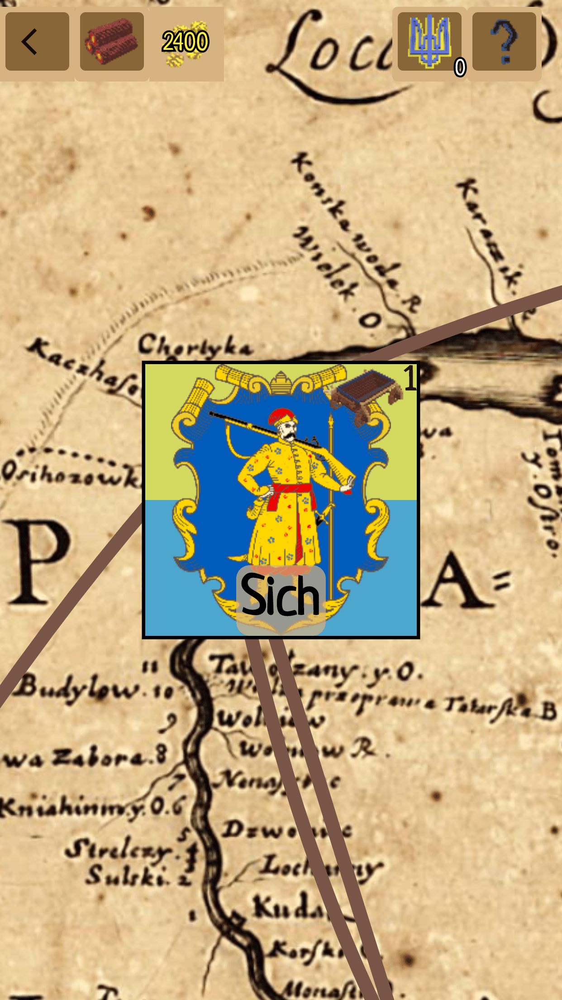
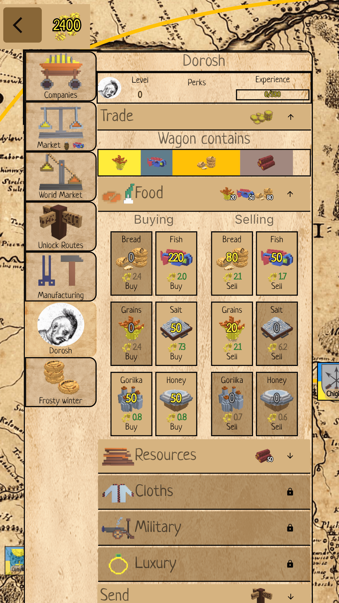
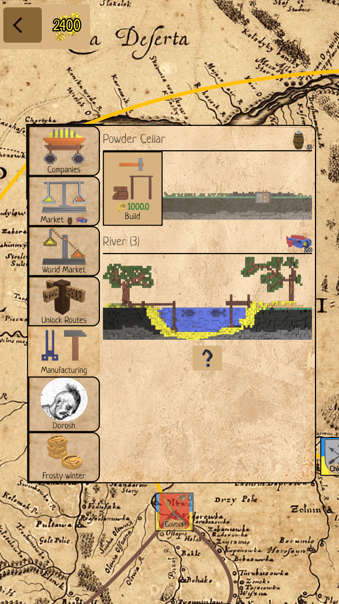
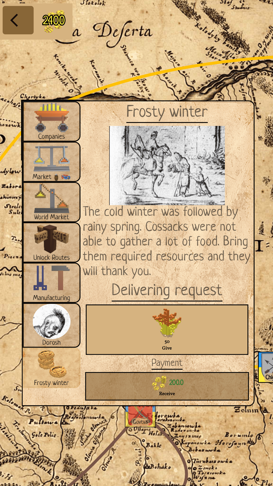
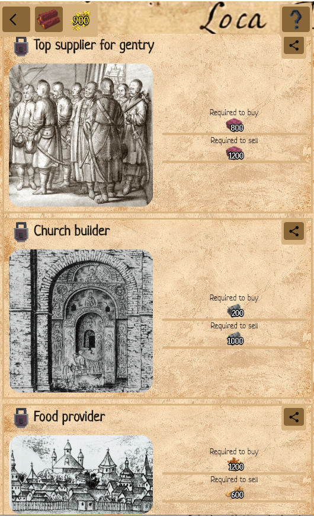
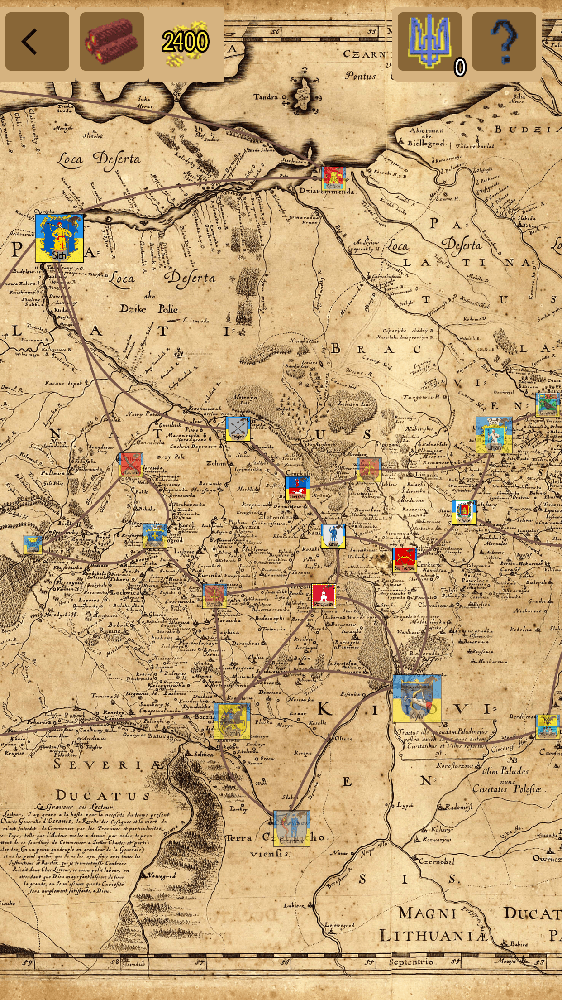

# chumaki

Full source code of A trading game "Loca Deserta: Chumaki" set in Ukraine in XVII.

## Dev blog

[Buiding Game with Flutter on Youtube](https://www.youtube.com/watch?v=bJV_XcQcmIg&list=PLFLb_LwRwa-vx3UtBo4FAsoBlXgQl_Wse)

# Loca Deserta: Chumaki

The fourth game from Universe of [Loca Deserta](https://locadeserta.com/index_en.md). Try yourself as a trader in Ukraine in XVII century!

## Web version

[Chumaki Online](https://locadeserta.com/chumaki)

## Version for Android:

Or download APK file:

[Chumaki APK](
https://github.com/gladimdim/locadeserta/releases/download/universe-1.0/chumaki_1.0.apk)

## Version for iOS:

## Version for Windows:

[Download VC++ Redistributable](https://support.microsoft.com/en-us/topic/the-latest-supported-visual-c-downloads-2647da03-1eea-4433-9aff-95f26a218cc0) pacakage before launching. (I guess you already have it installed).

Download, unpack and launch chumaki.exe:
[Chumaki for Windows 10](https://github.com/gladimdim/locadeserta/releases/download/universe-1.0/chumaki_windows_1.0.zip)

## Version for macOS:

Download, unpack and launch chumaki.app:
[Build for macOS](https://github.com/gladimdim/locadeserta/releases/download/universe-1.0/chumaki_macos_1.0.zip)

# Gameplay

 

The game starts at Sich. You have only one wagon with an otaman and an access to couple cossack towns. Check the prices of goods, find the best initial routes for trade and dispatch wagons. 

## Trading and Market

 

At market you can check the town stocks and the prices.

At Global Market view you can check the prices at all towns for specific items and the profit you may receive, if you buy at this town and sell at the other.

## Otamans (Leaders)

 

Hire otamans for new wagons to receive the experience when selling goods. Once your otaman levels up, you may unlock a new park which gives an access to new goods category.

## Manufacturing

 

Sooner or later, the amount of goods on market will decrease, that is why you need to build manufacturings at towns. These manufacturings will issue new goods to markets.

## Events

 

Once you visit the town it may give you some task to do. Usually it means brining some resources for the town. In return you get experience and lots of money.

## Achievements

 

In game there couple dozens of different achievements.

## Map

 

The game has more than 25 towns. Some of them are manufacturing centers, so it is better to unlock them and build the manufacturings.
